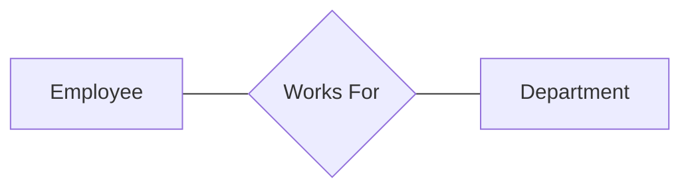
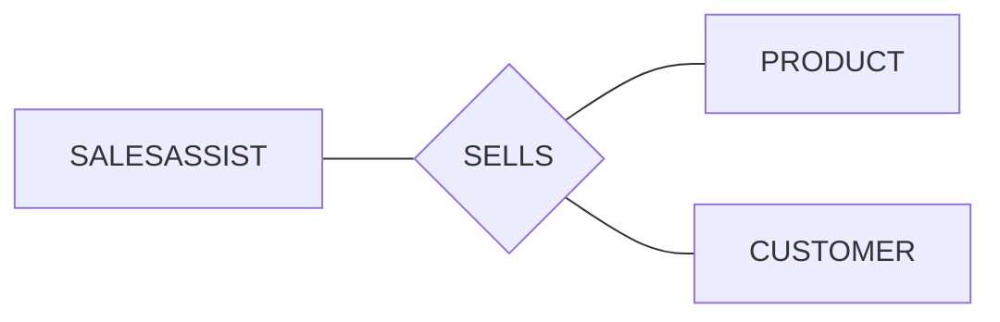
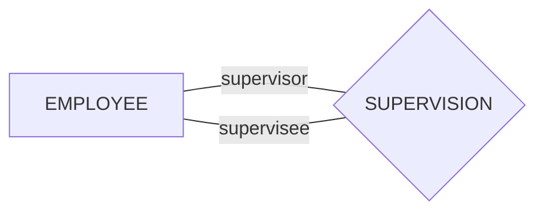
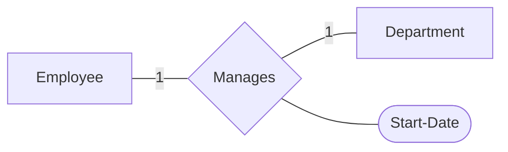
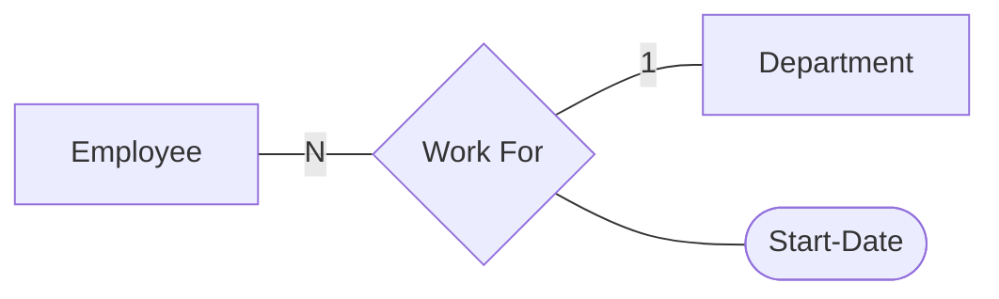
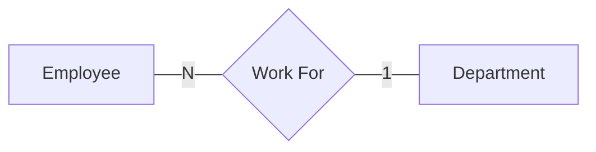
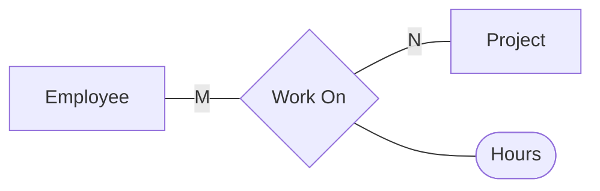

# Week 3
**Lecturer**: Uma Maheswari, Faculty for BITS Pilani WILP
[](mailto:umamaheswaris@wilp.bits-pilani.ac.in)
**Date**: 07/Aug/2021

## Topics Covered
1. Answer to questions from previous class
2. 


## Answer to questions from previous class
![[Pasted image 20210731182455.png]]
**Q1**: Answer
**Name** -> Simple
**Age** -> Derived
**addr** -> Composite
**pho** -> Simple, Multi Valued
**DOB** -> Stored

**Q2**: Answer
Since there are two addresses, the attribute is multivalued. and since the address itself is a composite attribute, the Employee addr is a **composite multivalued**

**Q3**: Answer
We know that $P_k \in C_k \in S_k$
1. Super Key $S_k$ -> BookID, BookID-Name, BookID-Author, Name-Author, BookID-Name-Author
2. Candidate Key $C_k$ -> BookID, Name-Author
3. Primary Key $P_k$ -> BookID

**Q4**: Answer
1. Candidate Key $C_k$ -> PAN, Licence#-address
2. Primary Key $P_k$ -> PAN

**Q5**: Answer
K1 is the Pk since it has the least composition

**Q6**: Answer
Composite Key attributes -> Custid-orderid, Name-addr

## Relationship

In the above diagram, the two entities are having the relationship 'works for'.
![[Pasted image 20210807172459.png]]

### Relationship Properties
#### Degree of relationship

In the above example the degree of the SELLS relationship is 3


In the above example the degree of the Works For relation is 2


The above relation is a unary relationship where the relationship is with itself

#### Role Name
In case of Unary relationship, we give a role name to the entities. For example in the supervision relationship, there are some employees who are supervisor and some will be supervisee. Here supervisor and supervisee are the role names

#### Mapping Constraints
##### Cardinality Constraints
1. 1 to 1 relationship
	```mermaid
	graph LR
	A[Employee]-- 1 ---B{Manages}
	B-- 1 ---C[Department]
	```


2. N to 1 relationship
	```mermaid
	graph LR
	A[Employee]-- N ---B{Works For}
	B-- 1 ---C[Department]
	```
	N employees work on

3. M to N relationship
	```mermaid
	graph LR
	A[Employee]-- M ---B{Works On}
	B-- N ---C[Projects]
	```
	M employees can work on 1 project or 1 employee can work on N projects

#### Participation Constraints
- How many people are participating in a relationship
- Total Participation
	```mermaid
	graph LR
	A[Employee]-- N ---B{Works For}
	B-- 1 ---C[Department]
	```
- All employess participate in a department
- But not all departments need to have
- $Cardinality + Optionality = multiplicity$

#### Relationship with attributes:
Consider the following 1 to 1 case:

Start date attribute can show when the employee managed a department, hence the start date can be in either of the entity set

Consider the following N to 1 case:

Here start date is associated to every employee , since start date is unique for every employee but not the other way around, start date can be in employee table.

Consider the following M to N case:

In the above case, the hour data must be in the relationship table since it cannot be associated to either employee or a project tables.

#### MIN-MAX constraint
![[Pasted image 20210807175212.png]]


In the above relation min-max form for Employee is {1,N} and for department is {0,1}

### Entity Types
#### Weak and Strong
![[Pasted image 20210807180116.png]]
- An entity that does not have a key attribute is a weak entity (Denoted by double rectangle)
- And a strong one has a key
- A double diamond relationship denotes a relationship between a strong and weak entity
- In the above example the Dependents entity does not have a key, hence it uses the employee id as the key
- Driver license entity cannot exist without person entity


### ER Model
Refinement
![[Pasted image 20210807180822.png]]

Invese refinement
![[Pasted image 20210807180843.png]]

### Binary and Ternary Relationships
![[Pasted image 20210807180931.png]]

![[Pasted image 20210807181021.png]]
![[Pasted image 20210807181439.png]]


### Example of entities having more than 1 relationships
![[Pasted image 20210807181535.png]]

### Removing redundant relationship
![[Pasted image 20210807181628.png]]

### Aggregation
![[Pasted image 20210807182038.png]]

![[Pasted image 20210807182207.png]]

### Questions Answered
![[Pasted image 20210807182302.png]]
Q1 Answer
Taught during

Q2


Q5

---
Tags: [[!DatabaseDesignAndApplicationIndex]]