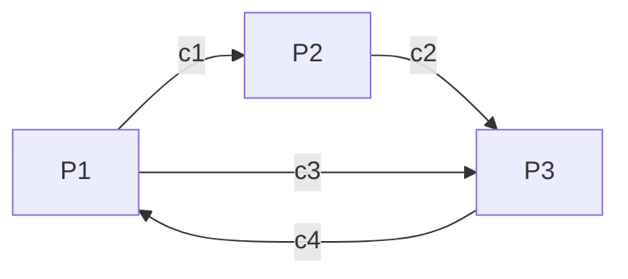

# Pre Reading for Week 1
**NOTE THAT THIS PAGE HAS DIAGRAMS THAT ARE BEST VISIBLE IN LIGHT MODE**
## Module 1
### Session 1
#### Relation between software components
![[DisctributedComputingImage.png]]
The middleware and the distributed application abstracts the fact that the application is being run by multiple computers to the user.

Some popular examples of Distributed computing:
1. Tor distributed network
2. Internet of Things: A network of several entities (ranging from small sensors to full fledged PCs) connected over a network so that an application can make sense of this data as a whole
3. Cloud computing is also a distributed computing paradigm.

### Session 2
#### Multiprocessor Vs Multi-computer systems
![[Pasted image 20210729212239.png]]

##### Multiprocessor
- Multiple CPUs connected with multiple memory banks through a high speed connection network (Uniform or non uniform memory access model). 
- One cannot allow a more than one processor access the same memory bank unless some sort of synchronization is done to serialize the arbitrate the access request.
- In a Symmetric multi processor machine all CPUs have the autonomy of deciding what it needs to be done (No master slave)
- In an Asymmetric multi processor machine, there is a concept of master slave where the master processor decide what the other processors needs to compute.
	![[Pasted image 20210729213134.png]]
- The multiple processors can connect to a particular memory bank when a particular switch is clicked on in the case of **cross point switch**, this method is not feasibile since the number of cross connection can be limiting for very large configurations of CPU and memory banks
- In case of an **omega switching network**, each omega switch is arranged in stages and the layers allow for lesser switches to pair the CPUs to the memory banks
- In both of the above cases the s
##### Multi-computer
- Multiple computers are connected over a high speed connection network, where the latency involved in this communication depends on the type of distributed computing designed (Varies from cluster computing, grid computing, IOT, or a common consumer computers connected together across the interweb)
- Unlike multiprocessor systems, the computers themselves do not need switching networks as explained above but can be connected over networks (LAN, WAN, MAN)

#### Pros and Cons of Distributed systems
- **Pros**
	1. Communication and resource sharing possible
	2. Price to performance ratio is better
	3. More reliable and easily scalable
	4. Potential for incremental growth
- **Cons**
	1. Requires OSs to be able to work in a distributed mode(same goes for applications)
	2. High speed reliable network connectivity is essential (Like GARUDA Grid)
	3. Security and privacy (Similar to networking, the risks of getting hacked affects distributed computers as well)

#### Design issues
##### Scaling
1. If possible use asynchronous communication, since more the synchronous communication the worse it scales (Only if possible)
2. One can also move parts of computation(To the client) in order to reduce latency from the server side
	![[Pasted image 20210729214431.png]]
	Here you see that the form checking is done on the client side which will make the form processing part of the server more scalable.
3. DNS is a good example for distributed query processing where a whole URL

##### Other design issues
1. Lack of global knowledge 
2. Naming (Name resolutions done by DNS is a challenging task)
3. Compatibility (When multiple resources are used together all must be compatible)
4. Process synchronization
5. Resource management (Hard to arbiterate tasks)
6. Security

### Session 3
#### RPC (Remote Procedure Call)
1. Issues:
	1. Identifying and accessing the remote procedure
	2. Parameters required to run the procedure
	3. Return values that need to be given once the call is sompleted
2. Examples:
	1. **Sun RPC**
	2. Microsoft DCOM
	3. OMG's CORBA
	4. Java RMI
	5. CML/RPC
	6. SOAP/.NET
	7. AJAX(Asynch. Javascript and XML)
![[Pasted image 20210729221354.png]]

- In an RPC, there is a client machine that calls the procedures to the client-side stub (Which abstracts the remote calls)
- The binding server handles the queries by the client-side stub to know the server address to which the remote procedure must be sent to.
- The client processes the data (Like conversion of big endian and little endian differences) by something called marshalling parameters
- The server side stub unmarshals the params given and a call is done to do the work and the return value is again marshalled and sent to the client side stub
- The client again unmarshalls and gives the result back

A given procedure can be identified by the following:
1. Hostname (IP Address)
2. Program identifier (32 bit integers)
3. Procedure identifier (32 bit integers)
4. Program Version identifier

Example of RPC programming

Create a RPC file as follows:
```
struct square_in {
	long arg1
};
struct square_out {
	long res1
};
program SQUARE_PROG {
	version SQUARE_VERS {
		square_out SQUAREPROC(square_in) = 1;
	} = 1;
} = 0x13451111;
```
Take that file and give it to rpcgen (Developed by sun microsystems)
![[Pasted image 20210729222543.png]]

the rpc gen automatically produces the necessary files.

Now we need to write the Client side logic to make the Remote call:
![[Pasted image 20210729223412.png]]

Here we are including the "square.h" file where we can get access to the structs for the input, and even a client handle to pass the required params to send to the processing server

Now we need to write the server side logic to process the remote call:
![[Pasted image 20210729223817.png]]
Here we define the remote function that needs to be run based on the conventions put on by sun microsystems

## Module 2
### Session 1
#### What is a distributed program?
- A program that consists of a set of n **asynchronous processes**.
- These processes **do not share a global memory** and use only **message passing APIs** for coms.
- These process **do not share a global clock** that is accessible at the same time. The process 
- These process executions and message transfers are **asynchronous**.

#### Model of distributed executions
Given 3 processes $p1$, $p2$ and $p3$, we represent them in a space-time diagram where Time is in x and space is in y axis. 
![[Pasted image 20210730220659.png]]

Here we see the relationships between the events for each process

| Event | Process | Type                              | 
| ----- | ------- | --------------------------------- |
| $e1$  | $P1$    | Local Event                       |
| $e2$  | $P1$    | Message Send Event (to $e5$)      |
| $e3$  | $P1$    | Message Receive Event (from $e4$) |
| $e4$  | $P2$    | Message Send Event (to $e3$)      |
| $e5$  | $P2$    | Message Receive Event (from $e2$) |
| $e6$  | $P3$    | Local Event                       |
| $e7$  | $P3$    | Local Event                       |
| $e8$  | $P3$    | Local Event                       |

- A local event is an event that is local to a given process
- A Message send event is an event in a process which asynchronously sent a message to another process
- A Message receive event is an event in a process which asynchronously receives a message from another process
- The diagram above shows us causal-effect relationships between events across different processes that gives us an idea on how to design a distributed system

#### Models of communication networks
There are namely 3:
1. FIFO
2. Non FIFO
3. Causal Ordering

Consider the following processes ($P1$, $P2$ and $P3$) with communication channels($c1$, $c2$, $c3$ and $c4$):



- If $P2$ sends messages $m1$ first and then $m2$ to $P3$ through the channel $c2$, then if $c2$ was a FIFO channel then $P3$ receives $m1$ first and then $m2$, making FIFO channels very predictable.
- If $P3$ sends four messages $m1$, $m2$, $m3$ and $m4$ through the channel $c4$, then if $c4$ was a Non FIFO channel then $P1$ would receive the messages in random order. This is useful if the algorithms in place can handle receiving messages in random order.
- If a channel follows causal order, then we do not need to check if a message was sent in a particular order or not, since for every message sent there is a receipt even in a process and the ordering is maintained by the receiving end of the process.

#### Global state of a DS
- A local state of a process is the current execution state at which a particular process is in.
- A Global state of a DS is a collection of such above mentioned local states of processes and channels
- The global state $GS$ is defined as:
	$$
	GS = \{\ \bigcup_i\ LS_i^{xi}\ ,\ \bigcup_{j,k}\ SC_{jk}^{yj,\ zk}\ \}
  $$
	$GS$ is the union of all Local States of all machines and all the messages across all the message channels.
- A $GS$ is meaningful only when all the states of all the components of the DS are recorded at the same instant
- The only way that is possible is when all the processes are synchronous in nature or if there were a global, instantaneously accessible clock (Both of which are impossible in a typical DS)
- To calculate the $GS$ there exists multiple algorithms to calculate the same

#### Consistent global state
![[Pasted image 20210730224519.png]]
- In the above diagram if we were to calculate the $GS_1$ at the red line drawn, we can say that the $GS_1$ is the sum of $LS_1$, $LS_2$, $LS_3$ and $LS_4$. Here the $GS$ is strongly consistent since there are no send or receive messages crossing in that slice of time.
- In the same diagram $GS_2$ is the sum of $LS_5$, $LS_6$, $LS_7$ and $LS_8$. Here the $GS$ does have a record of the message sent by $e_1^4$ but not the state of the message being received by $e_3^5$, hence the $GS$ although consistent enough to use it for calculating typical things such as deadlocks etc but just not strongly consistent.
- An $GS$ is said to be inconsistent if the local states were calculated in a way where the message receive event is considered but the corresponding message sent is missed. This makes the $GS$ is rendered useless.

### Session 2
#### Logical Clocks
Lamport Logical Clocks (Scalar Time)
- Causality among events in a DS is a way of analyzing processes and infer details regarding the computation.
- The knowledge of causal precedence relation among several events of different processes helps solve a variety of problems in a DS.

##### Scalar Time
- In a scalar time clock, we condense the process, its local view of the global time into a single variable called $C_i$.
- With the above assumption there exists 2 rules to update the internal clock:
	1. **Rule 1**: Before executing an event, process $p_i$ executes the clock value to be as:
		$$
		C_i := C_i + d\ \ \ (d > 0)	
    $$
		In general, every time $R_1$ is executed, $d$ can also have a different value.
	2. **Rule 2**: Each message piggybacks the clock value of its sender at sending time. When a process $p_i$ receives a message with timestamp $C{msg}$, it executes the following actions:
		1. $$
		C_i := max(C_i, C_{msg})
	 $$
	 	
		2. Execute $R_1$
		3. Deliver the message
- Example:
	 ![[Pasted image 20210731012809.png]]
	Looking at the above scenario we can infer that if one event ($e_i$) sends a message to another event($e_j$) we can say that:
	$$
	for\ two\ events\ e_i\ and\ e_j\ ,\ e_i\ ->\ e_j =>C(e_i) < C(e_j)
  $$
    But the reverse is not true. 
- **There are the following problems when it comes to this clock**:
	- **Non consistency**: We can never say that the event $e_1$ had happened before $e_5$ merely because the clock value of one was lesser than the other. This is because there is no direct or indirect link that connects $e_1$ to $e_5$.
	- There is a problem when the clock values are same for two events. In this case we can take precedence by considering the precedence of the process itself (Take the process index values into consideration). Considering the above example $e_1$ and $e_3$ have the same clock values so we can never say which one happened before what, hence we can use the indexes of the process itself, since index of process $P_2$ is greater than process $P_1$ we can assume that $e_1$ has happened before $e_3$
	- Another issue is the fact that this clock is not consistent in nature, by that we mean that
	