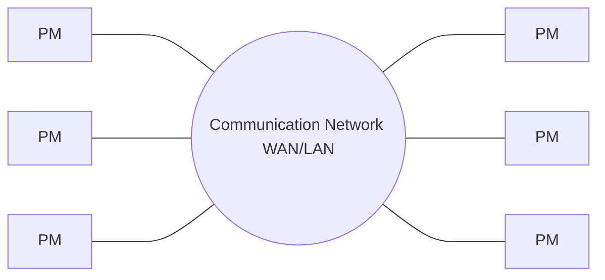

# Week 1 
Lecturer: [Barsha Mitra](http://a.impartus.com/#/profile/1985732), CSIS Dept, BITS Pilani, Hyederabad Campus

Date: 24/Jul/2021

## Topics covered
1. What is a distributed system?
2. What is time and space complexity?

C, C++, Java, Python

virtual lab

## What is a flipped mode course?
A couerse where there is content from a courseware and a live lecture

the events 
Quizzes and Assignments will be done online in elearn portal

2 Quizzes (MCQ type) predetermined time slots
1 Assignment
1 Mid Sem (Half of the modules) (Theoretical)
1 Comprehensive (All modules) (Theoretical)

Collection of indipendent individual entites (Can function on it's own) to solve a given task collectively

1. No common physical clock(system clock)
2. No shared memory - employs message passing for communication
3. Geographical separation - All the nodes taking part in the problem solving can be placed in different locations geographically
4. Autonomy and heterogeneity
	1. Each node is a fully finsctioning independent system irrespective of being taking part in a distributed system.
	2. The processors of the nodes are loosely coupled
	3. Different processor speeds and operating systems are allowed
	4. And despite all these differences they cooperate with one another
	5. 