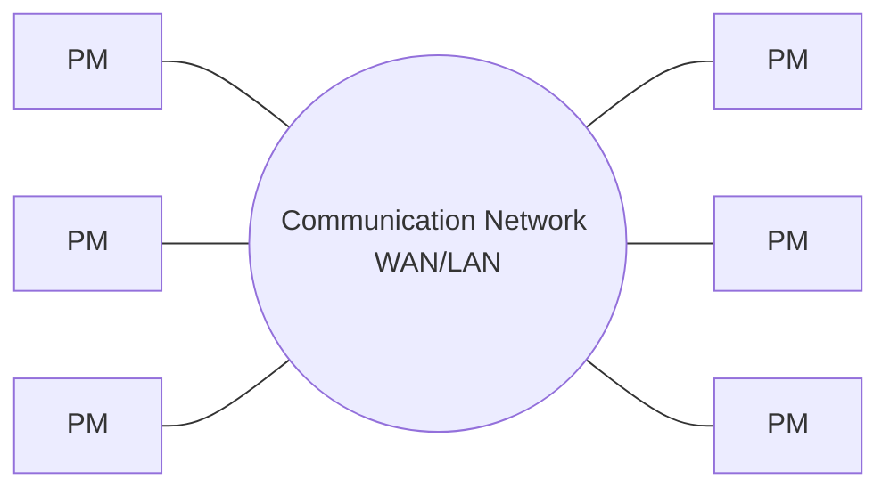
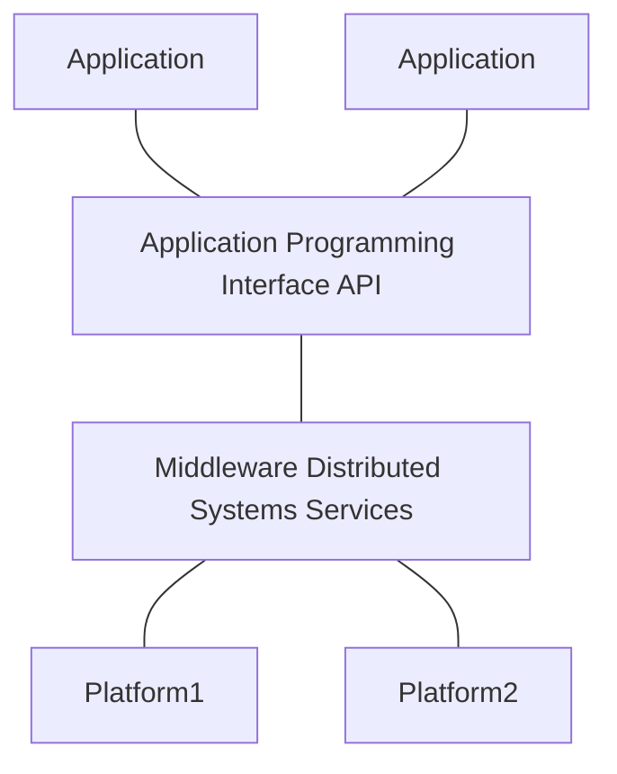

# Week 1 
**Lecturer**: [Barsha Mitra](http://a.impartus.com/#/profile/1985732), BITS Pilani, Hyderabad Campus

**Date**: 24/Jul/2021

**NOTE THAT THIS PAGE HAS DIAGRAMS THAT ARE BEST VISIBLE IN LIGHT MODE**

## Topics Covered
1. What is a flipped mode course?
2. What is a distributed system?
3. Motivations for a distributed system
4. Coupling
5. Parallel Systems
6. UMA (Uniform Memory Access) Model
7. Omega Network (An example of UMA)

### What is a flipped mode course?
A course where there is content from a course ware and a live lecture

the events 
Quizzes and Assignments will be done online in elearn portal

2 Quizzes (MCQ type) predetermined time slots
1 Assignment
1 Mid Sem (Half of the modules) (Theoretical)
1 Comprehensive (All modules) (Theoretical)

### What is a distributed system?
Collection of independent individual entities (Can function on it's own) to solve a given task collectively

1. No common physical clock(system clock)
2. No shared memory - employs message passing for communication
3. Geographical separation - All the nodes taking part in the problem solving can be placed in different locations geographically
4. Autonomy and heterogeneity
	1. Each node is a fully functioning independent system irrespective of being taking part in a distributed system.
	2. The processors of the nodes are loosely coupled
	3. Different processor speeds and operating systems are allowed
	4. And despite all these differences they cooperate with one another

Middleware drives the distributed system and the heterogeneity at a platform level is abstracted by APIs.

Common Object Request Broker Architecture (CORBA)
Remote Procedure Call (RPC)
Distributed Component Object Model (DCOM)
Remote Method Invocation (RMI)

### Motivations for a distributed system
1. Share resources
2. Access to resources from different geographical locations (Like AWS Cloud servers at different locations or even a work from home situation can be covered)
3. Increased performance/cost ratio, since there is a large resource pool and programs can be written in a way to efficiently use that pool to get tasks done more quickly
4. Reliability, in the sense that since the system is distributed, even if one system breaks down, there is still a degree of availability of resources.
5. Scaling, in the sense that it is easy to increase performance by merely adding more nodes to a distributed system.
6.  Modularity and Incremental Expandability.

### Coupling
High coupling: Homogeneous modules and hence have more restrictions imposed on these systems
Low coupling: Heterogeneous modules and hence more flexibility is gained

### Parallel Systems
1. Multiprocessor systems:
	- Direct access to shared memory area/address space
	- Usually do not have a common system clock
	- Eg, Omega, Butterfly Networks
2. Multicomputer parallel systems
	- There are multiple processors but no direct access to shared memory/address space
	- There can be more than one nodes, but most likely are not geographically separated
	- Eg, IBM Blue gene, CM* Connection Machine
3. Array Processors
	- Collocated
	- Tightly Coupled
	- Common system clock

### UMA (Uniform Memory Access) Model
1. Direct access to shared memory
2. **Access latency**: Waiting time to complete an access to any memory location from any processor
3. Access latency is same for all processors
4. Processors remain in close proximity
5. Connected by an interconnection network
6. Processors are of the same type

### Omega Network (An example of UMA)
2x2 switching elements
data can be sent on any one for the input wires
n-input and n-output network uses
$log_2(n)$ stages
$log_2(n)$ bits for addressing
n processors, n memory banks

$\frac{n}{2}log_2(n)$ switching elements of size 2/2
interconnection function defines how output $i$ of one one stage is connected to input $j$ of the next stage
In this example the interconnection function is a left rotation operation on the binary representation of $i$ to get $j$

---
Tags: [[!DistributedComputingIndex]]